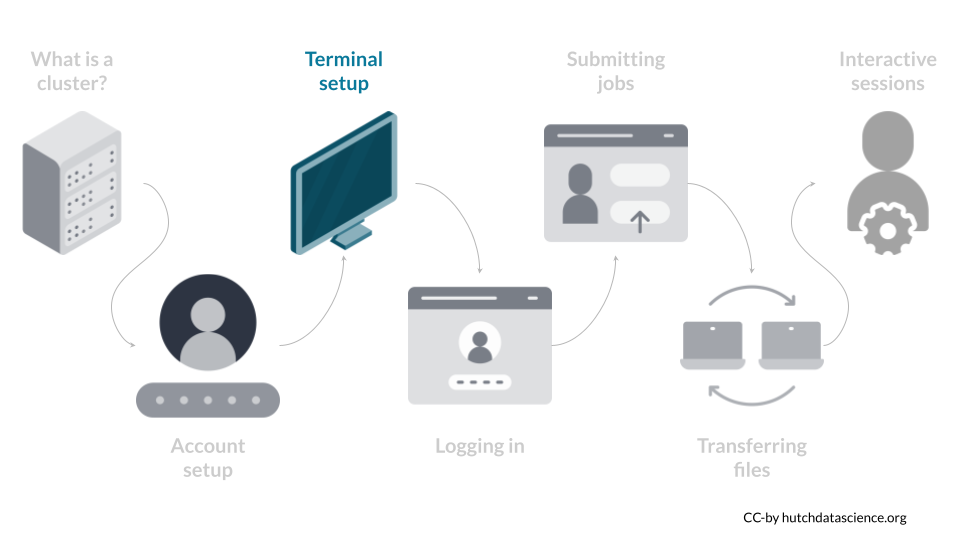
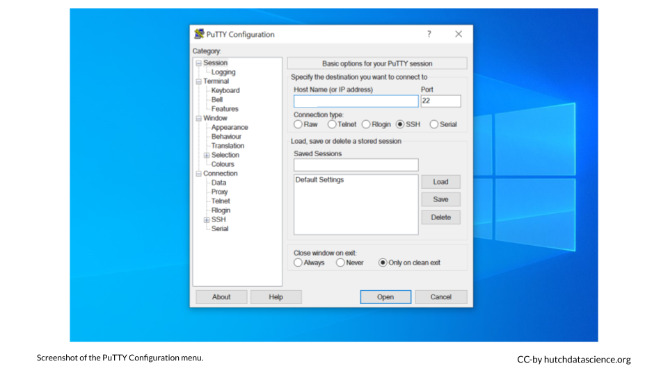
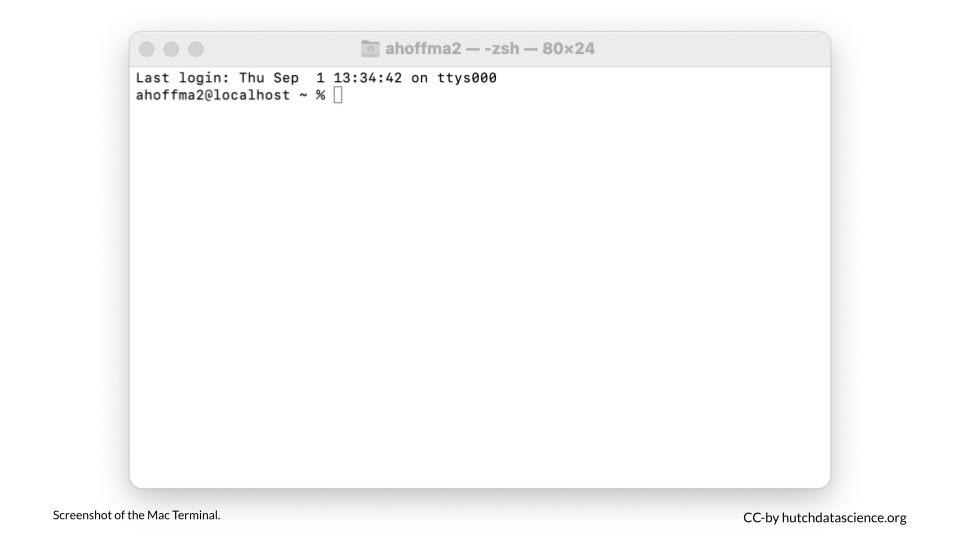

# (PART\*) Cluster 101 {-}

# Terminal Setup {#terminal}



The next step is getting familiar with your Terminal. This is your portal to the cluster.

## What is a terminal?

The Terminal is a [command line interface](https://www.codecademy.com/article/command-line-interface){target="_blank"}. In other words, the Terminal is a software application that allows you to issue commands directly to your laptop or desktop computer. The Terminal is very useful because it allows you to run commands that don't have a point-and-click equivalent. It can also connect you to computer networks, such as the Fred Hutch cluster! The Terminal setup is different depending on your operating system. Jump to the [Windows](#windows), [MacOS](#mac), or [Linux](#linux) sections below.

<div class = "terminal">
"Terminal" used to be synonymous with "computer". With the creation of operating systems like Windows and MacOS, computers became much easier to use and exploded in popularity! Your colleagues are almost always referring to the command line application when they say "Terminal".
</div>

## Windows Setup {#windows}

<details><summary>Click to view steps</summary><p>

You will need to install a Terminal application called PuTTY to connect to the Fred Hutch Cluster.

1. You should then see PuTTY available in the Software Center. Click "Install" and go through the Setup Wizard.

    

    

    <div class = "notice">
    You can also [install PuTTY manually](faq.html#manual-putty){target="_blank"} if you don't see it in the Software Center.
    </div>

1. PuTTY should now be available in your applications. Click on PuTTY to open.

    

1. You should now see the PuTTY Configuration menu.

    

</p></details>

## Mac Setup {#mac}

<details><summary>Click to view steps</summary><p>

Mac machines come with a Terminal installed. 

1. Go to Finder > Applications > Utilities > Terminal and double-click. 

    

1. Your Terminal should look like this:
    
    

</p></details>
    
## Linux Setup {#linux}

<details><summary>Click to view steps</summary><p>

The commonly used Linux distribution, Ubuntu, already comes with a Terminal installed. 

1. Press ctrl + alt + T. This should open a Terminal window.

1. Update the Terminal and prepare it for connecting to the cluster by running:

```
sudo apt install openssh-client
```

Enter your password and enter `Y` when prompted.

</p></details>
