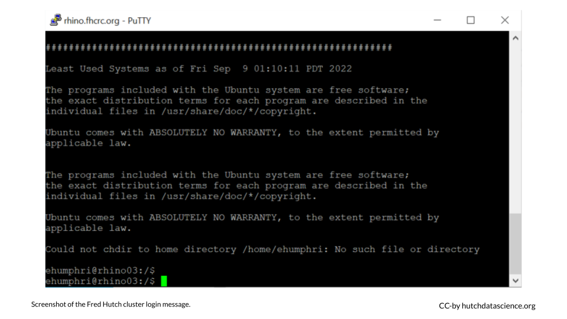

# Logging In


Now that you have your Terminal application ready, you want to connect to the cluster. You will do this using a method called [SSH](https://www.ssh.com/academy/ssh/protocol){target="_blank"}, which stands for "Secure SHell".

## What is `SSH`?

SSH is a secure way to remotely connect to another computer or network of computers. In other words, SSH helps us protect your data and the data on the Fred Hutch cluster through authentication.

<div class = "dictionary">
**Hostname**  
  
The hostname is the name, or label, assigned to a computer in a network. We are connecting to hostname `rhino.fhcrc.org` or `rhino` for short.
</div>

## Connect Securely

Before moving on, you will need to connect to the Fred Hutch wifi network, a networked ethernet jack, or the [Fred Hutch VPN](https://centernet.fredhutch.org/cn/u/center-it/help-desk/vpn.html){target="_blank"}. This is the first layer of security.

The next set of steps are specific to your operating system.  

## Windows Login 

<details><summary>Click to view steps</summary><p>

1. Go to the PuTTY Configuration menu. Under "Host Name" type **rhino** and click "Open".

    

1. You will be prompted to login. Type in your HutchNetID (e.g., `jsmith3`).

    
   
1. Enter your password. No`*` or symbols will show up, so type it in carefully!
1. You are now logged in! There should be a login message, with your name at the bottom.

    

Congratulations! You are now logged in to the Fred Hutch cluster!

</p></details>

## Mac Login

<details><summary>Click to view steps</summary><p>

1. Type the following commands, substituting in your HutchNet ID (no brackets):  

    ```
    ssh [HutchID]@rhino
    ```
1. You will see a message that looks like `The authenticity of host 'rhino (XXX.XXX.XX.XX)' can't be established.` Type in `yes` and hit enter.
1. Enter your password. No`*` or symbols will show up, so type it in carefully!
1. You are now logged in! There should be a login message, with your name at the bottom.

    
    
Congratulations! You are now logged in to the Fred Hutch cluster!

</p></details>
    
## Linux Login

<details><summary>Click to view steps</summary><p>

1. Type the following commands, substituting in your HutchNet ID (no brackets):  

    ```
    ssh [HutchID]@rhino
    ```
    
1. Enter your password. No`*` or symbols will show up, so type it in carefully!  
1. You are now logged in! There should be a login message, with your name at the bottom.  
  
Congratulations! You are now logged in to the Fred Hutch cluster!

</p></details>
