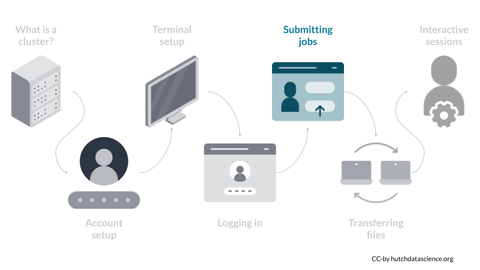
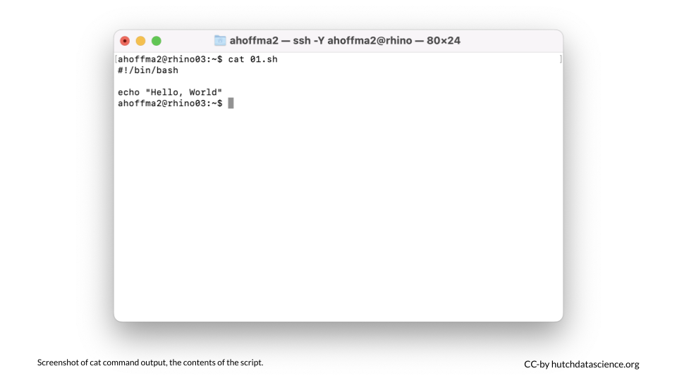
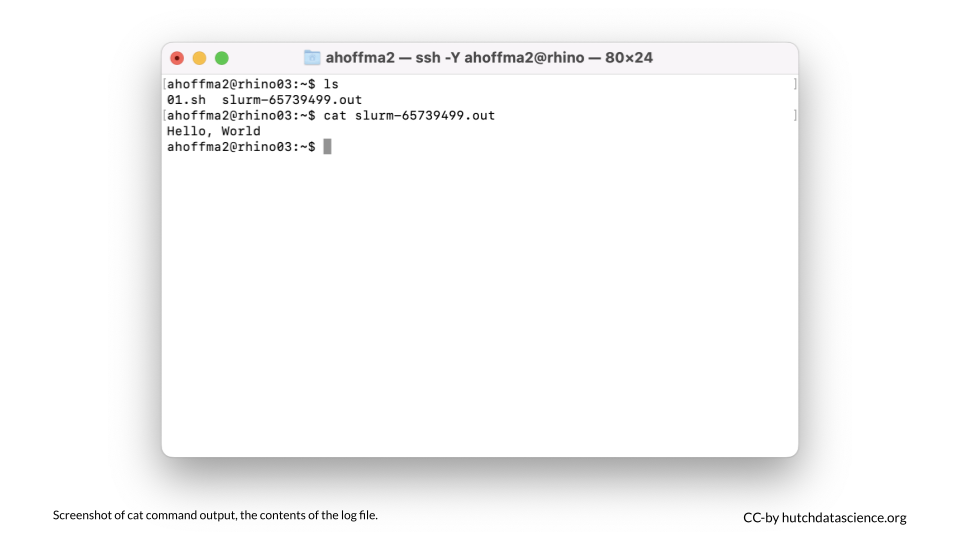

# Submit Your First Job



The strength of a computing cluster is the ability to do many jobs in parallel or on computers with more computing power than you have on your local computer. The best way to use the cluster is to create short snippets of instructions (a script) that a computer can perform without human input. Your script tells the computers to execute the instructions as individual jobs. 

Now that you've logged into rhino you will be able to send scripts to the networked computers in the cluster. The Fred Hutch cluster uses [Slurm](https://slurm.schedmd.com/overview.html){target="_blank"} to organize and prioritize jobs. Based on the instructions in your script, Slurm will find computing resources within the cluster to run your job along with all the other requests from other users.

In the next steps, we will go through a simple example where we download a single file. More complicated examples will use multiple files. We will discuss how to transfer files from your computer to the cluster in the [following chapter](#file-upload-and-download).

<div class = "notice">
The part of the cluster where you **log in** is called `rhino`. 
The part of the cluster where **jobs are run** is called `gizmo`. 
</div>

## Download the Script

We can use the `wget` command to download a script from GitHub. This means we don't have to write the script from scratch. Copy and paste the following into the terminal, and hit return:

```
wget https://raw.githubusercontent.com/FredHutch/slurm-examples/master/introduction/1-hello-world/01.sh
```


## Confirm the Download

Let's confirm that we can see the file we just downloaded. We can use the `ls` (list files) command for this. Type `ls` and hit return. You should see the file `01.sh` in your home directory. The `.sh` ending means this is a script meant to run from the command line. 

```
ls
```


## Inspect the Script

Let's next inspect the script. The `cat` command, followed by a file name, lists the entire contents of a specific file.

```
cat 01.sh
```



- The first line of the script, `#!/bin/bash`, indicates that this is a command line or "bash" script. 
- The second line is empty, and the third line, `echo "Hello, World"` means that the computer will "echo", or print out, "Hello, World".

## Submit the Script

We use the `sbatch` command to submit a script and start running a job on the cluster. Copy the following and hit return. You should see a message like "`Submitted batch job 12345678`". Your number will vary because this is a unique job identifier.

```
sbatch 01.sh
```

## Check the Output

Type `ls` again. You should now see a log file like `slurm-12345678.out` listed alongside your script `01.sh`. Let's use `cat` to inspect the output in the log file (the new file starting with `slurm` and ending with `.out`). Make sure you replace `[your-number-here]` with the number in your actual file. We should see our message has been printed! 

```
cat slurm-[your-number-here].out
```



<div class = "dictionary">

`ls`

This command lists the files in the current directory.

`cat filename` 

This command prints the contents of a specific file (_filename_).

`sbatch filename.sh` 

This command submits a job to the cluster with instructions specified in a `.sh` file.
</div>
