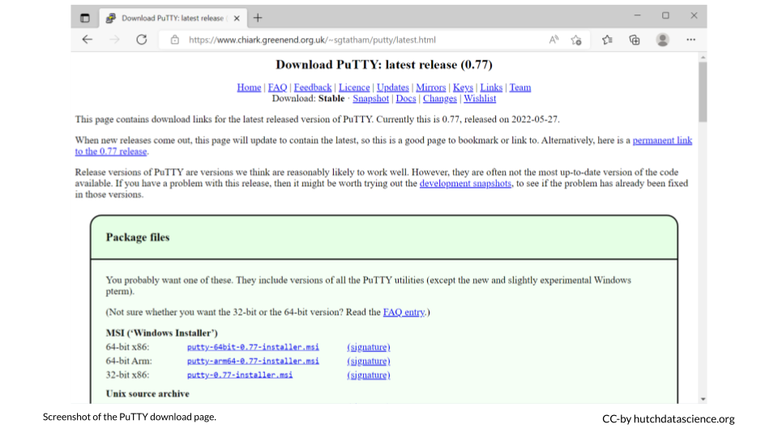
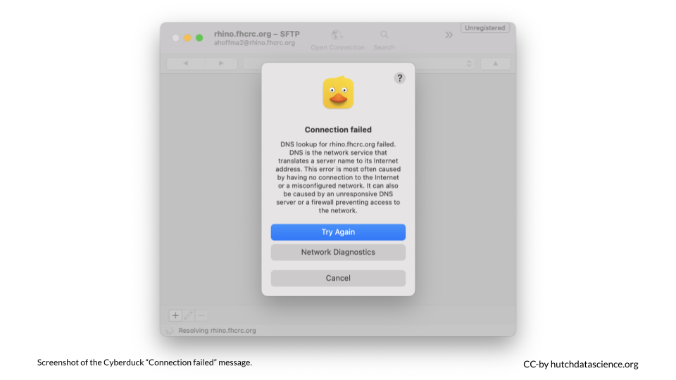

# (PART\*) Appendix {-}

# Provide Feedback {#feedback}

Please submit an issue about this course at our [GitHub repository](https://github.com/fhdsl/FH_Cluster_Guide/issues/new). You can also click the edit button on the top of the page in question.

# FAQ and Troubleshooting

## FAQ 

Here are some questions you might have.

### How can I manually install PuTTY? {#manual-putty}

Click to view steps

1. Click [here](https://www.chiark.greenend.org.uk/~sgtatham/putty/latest.html) to install the latest version of PuTTY. You will choose the 64-bit x86 installation with few exceptions.

    

1. Click through to install via the Setup Wizard.

## Troubleshooting

Here are some issues you might encounter.

### `ssh: Could not resolve hostname rhino: nodename nor servname provided, or not known` {-}

Click to view steps

This error means that your computer is having trouble connecting to rhino. Ensure one of the following is true:

1. You are connected to the Fred Hutch wifi network on campus.
1. You are connected to the Fred Hutch VPN
1. You are plugged into an ethernet cable on campus that taps into the Fred Hutch network. Note that not all ethernet wall jacks have this capability, so try another jack if you are having trouble. Please email the IT helpdesk and include your office number and the number on the jack if you find a jack that isn't working.

### `ssh: connect to host rhino port 22: Undefined error: 0` {-}

Click to view steps

This likely indicates a disruption to your internet connection and/or VPN. Ensure you are connected to the internet and connected to the Fred Hutch network on campus or the VPN.

### `Connection failed` message in Cyberduck {-}

Click to view steps

This likely indicates a disruption to your internet connection and/or VPN. Ensure you are connected to the internet and connected to the Fred Hutch network on campus or the VPN.

### `Invalid account or account/partition` when logging in {-}

Errors similar to this typically indicate that the account hasn’t been set up by SciComp. This is a quick fix if you [use the form mentioned in the course](account-setup.html#pi-account).

# Get Your Certificate {-}

You must complete the quiz - [Self-Test: Cluster 101](https://leanpub.com/courses/fredhutch/fredhutchcluster101/quizzes/self_test_101) - 
 with all questions correctly answered to earn your certificate for this course. Once complete:
 
 1. Go to the course [homepage](https://leanpub.com/courses/fredhutch/fredhutchcluster101/home)  
 1. Click on "Complete Course"  
 
    
    
 1. Click on "Generate Certificate"  
 
    
    
